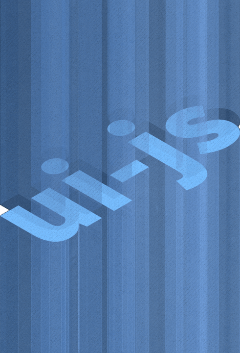

<section class='hero-section'>
  

    <h1>Welcome</h1>
    
What you need to build modern web apps

    <a href='/web-components/'>Web Components</a>
    <!-- <a href='/web-app/'>Web App Framework</a> -->
  

  

        
  

</section>

<section class="fullwidth ">
    

    

    

    <h2>Web Components</h2>
    
A collection of modern custom elements/web components.

    

</section>
